# ✈️ Tourism & Visitor Traffic Analytics

End-to-end Data Analytics project that transforms visitor traffic, seasonality, and destination data into actionable tourism insights using **SQL**, **Python**, and **Power BI**.

---

## 📌 Project Overview

This project analyzes multi-year visitor traffic across major destinations (Riyadh, Jeddah, Makkah, Madinah, AlUla, Dammam, Abha), monthly volumes, hotel occupancy, trip purpose, and origin markets to answer key business questions related to peak seasons, city performance, visitor profile, and operational planning.

The complete pipeline follows a real-world data analyst workflow:

**SQL → Python (Pandas + Matplotlib) → Power BI Dashboard**

Framed for **tourism and destination analytics** supporting capacity, marketing, and seasonal planning decisions aligned with growth priorities in the Kingdom.

---

## 🛠️ Tools & Technologies

- **SQL (MySQL)** – Data extraction and tourism traffic analysis
- **Python** – Data cleaning, exploratory data analysis (EDA), and visualization
- **Pandas & NumPy** – Data manipulation
- **Matplotlib & Seaborn** – Charts and visual insights
- **Power BI** – Interactive Tourism Analytics Dashboard
- **Git & GitHub** – Version control and project showcase

---

## ✨ Key Features

- Overall KPIs (Total Visitors, Estimated Spend, Avg Occupancy, Avg Stay)
- Visitors by city and monthly / yearly trends
- Hotel occupancy by city
- Peak months identification
- Trip purpose and origin market breakdown
- Spend and stay patterns by purpose and origin
- Interactive Power BI Dashboard with actionable recommendations

---

## 📈 Key Insights

- Visitor traffic concentrates in key destination cities
- Clear seasonal peaks require capacity and staffing planning
- Religious and leisure purposes account for a large share of visits
- Occupancy and spend patterns differ by city and origin market
- Top months should drive seasonal marketing and hotel readiness
- City-level monitoring supports better destination operations

---

## 📁 Project Structure

```
Tourism-Visitor-Traffic-Analytics/
├── data/
│   ├── monthly_city_traffic.csv
│   ├── visits.csv
│   └── summaries/
├── sql/
│   ├── 01_schema_and_load.sql
│   └── 02_analysis_queries.sql
├── python/
│   ├── 01_tourism_analysis.py
│   └── charts/
├── powerbi/
│   └── Tourism_Visitor_Traffic_Analytics_Dashboard.pbix
├── docs/
│   └── PowerBI_Dashboard_Guide.md
├── images/
│   ├── sql/
│   ├── python/
│   └── powerbi/
├── requirements.txt
└── README.md
```

---

## 🚀 How to Run the Project

### 1. SQL Analysis (MySQL)
- Create the database and tables using `sql/01_schema_and_load.sql`
- Import `data/monthly_city_traffic.csv` and `data/visits.csv`
- Run the analysis queries from `sql/02_analysis_queries.sql`

### 2. Python Analysis
```bash
pip install -r requirements.txt
python python/01_tourism_analysis.py
```

### 3. Power BI Dashboard
- Open `powerbi/Tourism_Visitor_Traffic_Analytics_Dashboard.pbix` in Power BI Desktop
- Or follow the step-by-step guide in `docs/PowerBI_Dashboard_Guide.md`

---

## 📊 Dashboard Pages (Power BI)

1. **Executive Overview** – KPIs, monthly trend, visitors by city  
2. **Cities & Seasonality** – Occupancy, spend, peak months  
3. **Purpose & Origin** – Visitor profile and spend patterns  
4. **Recommendations** – Capacity, destination focus, next steps  

---

## 🖼️ Screenshots

### Power BI Dashboard
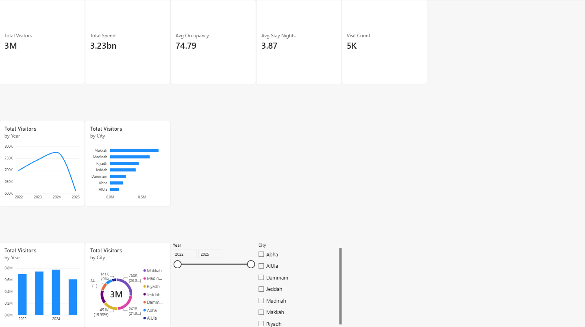


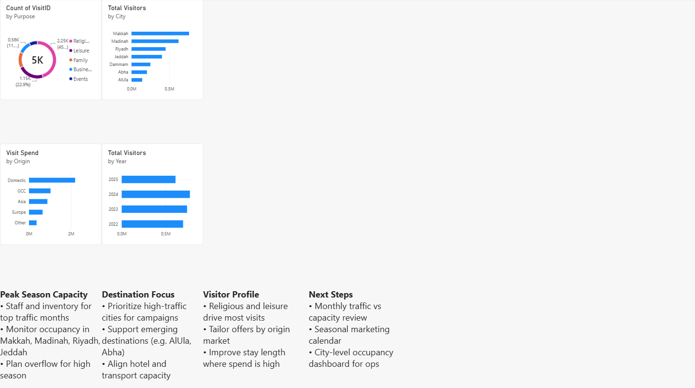

### SQL Analysis
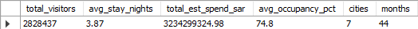
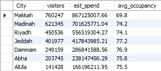
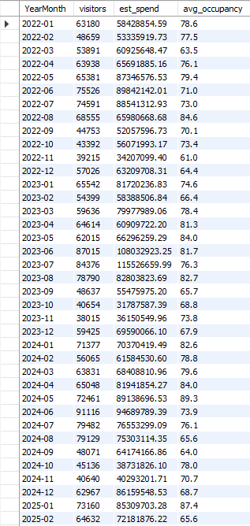
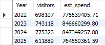
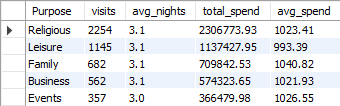
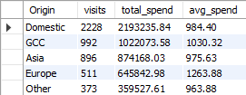

### Python Visualizations
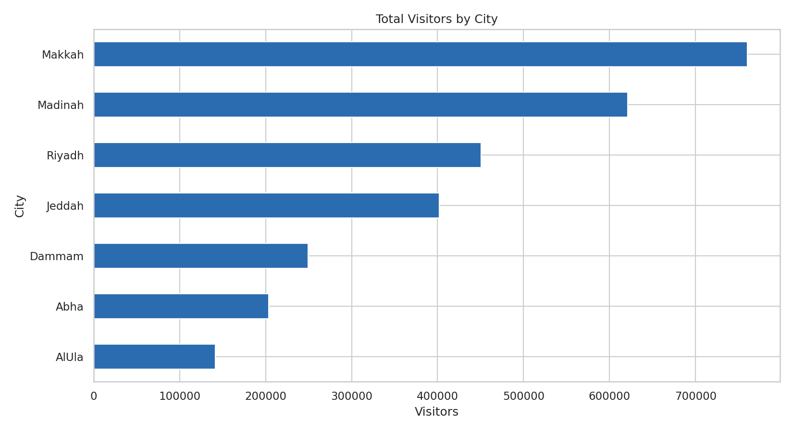
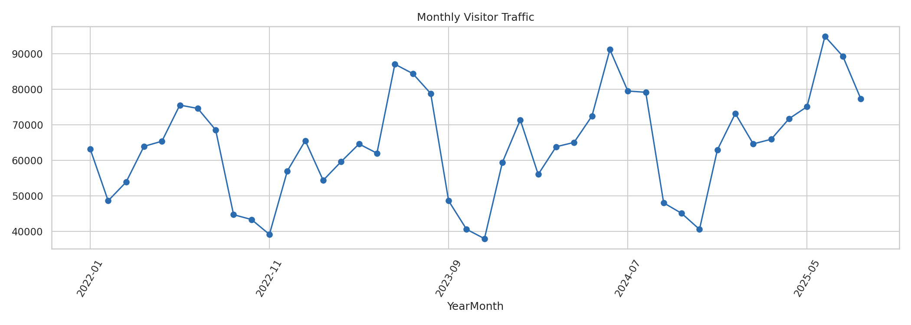
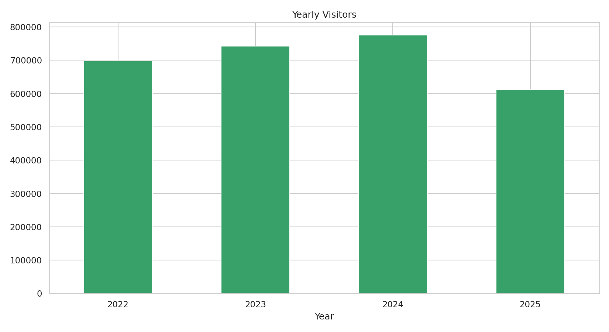
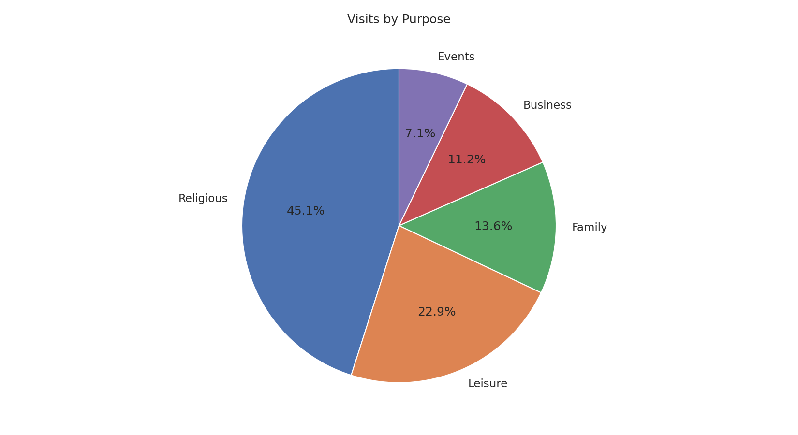
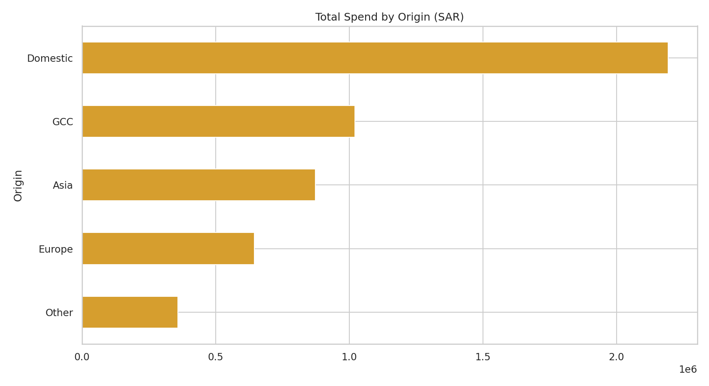
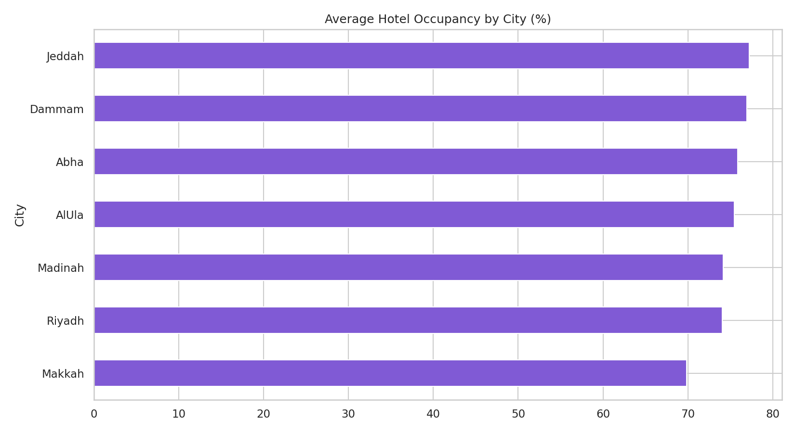

---

## 👤 Author

**Mubeen Salman**  
Aspiring Data Analyst  

- LinkedIn: [https://www.linkedin.com/in/mubeen-salman-459776364/]  
- GitHub: [https://github.com/MuhammadMubeen04]  

---

## 📄 License

This project is for educational and portfolio purposes.
